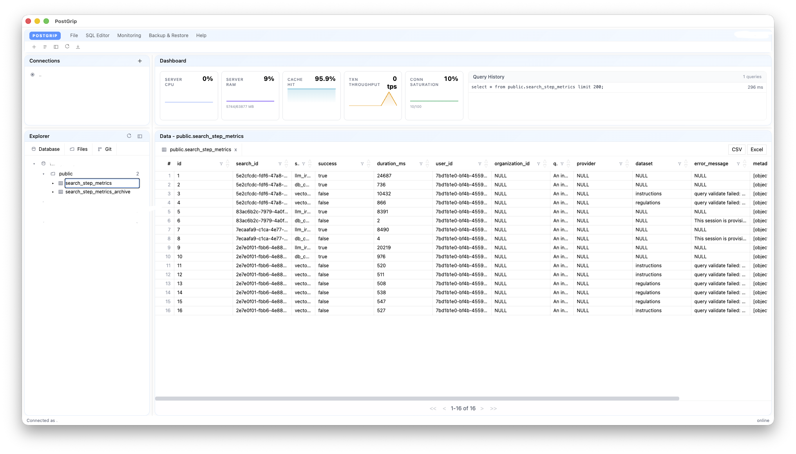
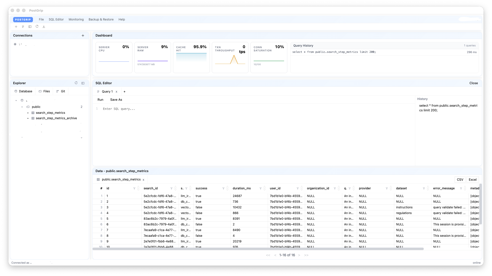
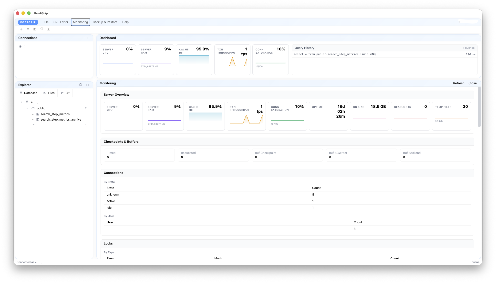
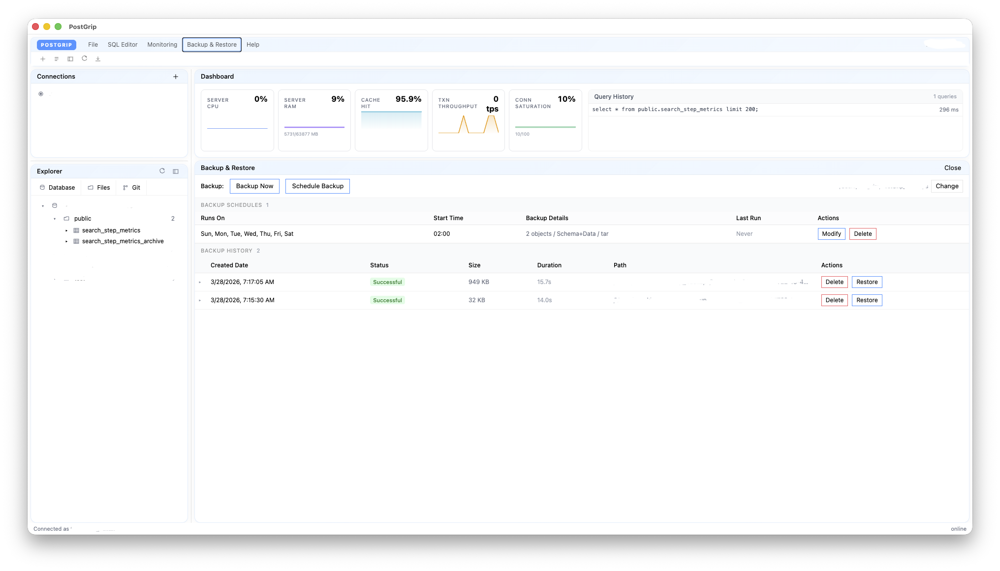

# PostGrip

**The PostgreSQL client that gets out of your way.**

PostGrip is a fast, lightweight desktop client for PostgreSQL. Browse schemas, write queries, edit data, and monitor your server — all from a clean, modern interface that feels native on macOS, Windows, and Linux.



## Why PostGrip?

- **Zero config** — Reads your `~/.pgpass` automatically and offers one-click connections
- **Fast startup** — Opens in under a second, auto-reconnects to your last database
- **Built for daily use** — Schema explorer, SQL editor with autocomplete, inline data editing, and real-time server metrics in one window
- **SSH tunnel support** — Connect through bastion hosts with password or private key auth
- **Cross-platform** — Ships as a universal macOS DMG, Windows installer, and Linux AppImage/deb

## Features

### Data View

Browse your database visually with the schema explorer, preview table data, and manage tables — all from a single pane.

- **Schema Explorer** — hierarchical database tree with schemas, tables, columns, keys, and indexes
- **Table Preview** — click any table to instantly preview its data with sortable, paginated columns
- **Connection Management** — save multiple connections, auto-import from `~/.pgpass`, auto-reconnect on startup
- **SSH Tunneling** — connect through bastion hosts with password or private key auth
- **Schema Operations** — right-click schemas to create new schemas and tables with a full table builder (columns, primary keys, foreign keys, indexes, and live SQL preview)
- **Table Operations** — right-click tables to modify structure, edit data inline, export (CSV, Parquet, pg_dump), or truncate/drop
- **File Explorer & Git** — browse the filesystem, view git status and diffs from the sidebar
- **Create Table** — visual table builder with column types, primary keys, foreign keys, indexes, and live SQL preview
- **Modify Table** — rename, add/drop columns, add foreign keys and indexes with live DDL preview
- **Export** — CSV, Apache Parquet, and pg_dump (SQL, custom, tar) formats

### SQL Editor

Write and run queries with a full-featured editor, then explore results in an interactive grid.



- **Syntax Highlighting** — CodeMirror-based editor with full SQL highlighting
- **Schema-Aware Autocomplete** — suggests table and column names from the connected database
- **Multiple Tabs** — open as many query tabs as you need, each with independent SQL and results
- **Query Presets** — one-click presets for Session info, Tables, and Activity
- **Result Grid** — sortable, paginated columns with drag-to-resize headers
- **Query History** — tracks recent queries with execution timing on the Dashboard
- **Export Results** — save results to CSV or Excel
- **Save Queries** — write queries to `.sql` files

### Monitoring

A dedicated full-pane view with comprehensive PostgreSQL server metrics, updated in real time.



- **Server Overview** — 9 metric cards with sparkline graphs: CPU, RAM, Cache Hit Ratio, TPS, Connection Saturation, Uptime, DB Size, Deadlocks, Temp Files
- **Checkpoints & Buffers** — timed vs requested checkpoints, buffer writes by checkpoint/bgwriter/backend
- **Connections** — breakdown by state (active, idle, idle in transaction) and by user
- **Locks** — current locks by type and mode, blocked queries with wait duration
- **Long Running Transactions** — queries running for more than 1 minute
- **Table Statistics** — top 50 tables by activity: scans, rows inserted/updated/deleted, dead tuples, size, last vacuum
- **Unused Indexes** — indexes with zero scans, sorted by size — candidates for removal
- **Replication** — replica lag monitoring (write, flush, replay lag)

### Backup & Restore

Full database backup management built into the app — back up on demand or on a schedule, browse history, and restore with one click.



- **Backup Now** — on-demand backups via `pg_dump` with format selection (Tar, Custom, SQL, Directory), scope (entire database or selected schemas/tables), content (schema + data, schema only, data only), and advanced options (no owner, no privileges, clean, compression)
- **Schedule Backup** — automated recurring backups with day picker, time picker, and the same full options as manual backups
- **Backup History** — status tracking (In Progress, Successful, Failed), file size, duration, expandable metadata, and per-backup Delete/Restore actions
- **Restore** — `.sql` files executed directly, `.dump` and `.tar` files restored via `pg_restore`
- **Configurable directory** — change where backups are stored, persisted across sessions
- **Auto-detection** of `pg_dump`/`pg_restore` in common Homebrew and Linux paths

### Additional

- **Help** menu with a built-in markdown user guide
- **About** dialog showing version, Electron, Node.js, Chromium, and platform info

## Tech Stack

| Layer | Technology |
|-------|-----------|
| Runtime | Electron 41 |
| Frontend | React 19, Tailwind CSS 4.2, CodeMirror 6 |
| Backend | Node.js (pg), TypeScript 5 |
| Build | Vite 6, electron-builder |
| Package Manager | bun |

## Getting Started

### Prerequisites

- [bun](https://bun.sh/) (v1.0+)
- [Node.js](https://nodejs.org/) (v18+)
- A running PostgreSQL instance to connect to
- `pg_dump` installed if you want to use the pg_dump export option

### Install Dependencies

```bash
bun install
```

### Development

```bash
bun run dev
```

### Production (local run)

```bash
bun run start
```

## Testing

```bash
# Unit/integration tests
bun run test

# Watch mode
bun run test:watch

# Coverage
bun run test:coverage

# Live PostgreSQL tests
bun run test:live

# Electron E2E tests
bun run test:e2e

# Electron E2E tests with a visible browser window
bun run test:e2e:headed

# Full suite
bun run test:all
```

`test:live` expects `DB_HOST`, `DB_PORT`, `DB_NAME`, and `DB_USER`. Password can come from `DB_PASSWORD` or from a matching entry in `~/.pgpass`.

`test:e2e` builds the app and runs Playwright against the packaged Electron entrypoint. The E2E helper uses an isolated temporary `userData` directory, so test runs do not read or overwrite your real saved connections.

The connected E2E flow also requires `DB_HOST`, `DB_PORT`, `DB_NAME`, and `DB_USER`, plus a matching `~/.pgpass` or `PGPASSFILE` entry. If that entry is missing, the connected specs are skipped.

## Building Installers

Build distributable installers for your platform:

```bash
# Current platform
bun run dist

# macOS (universal DMG -- arm64 + x64)
bun run dist:mac

# Windows (NSIS installer)
bun run dist:win

# Linux (AppImage + .deb)
bun run dist:linux
```

Output is written to the `release/` directory.

### Regenerate App Icons

```bash
node scripts/generate-icons.mjs
```

Generates `build/icon.icns` (macOS), `build/icon.png` (1024x1024), and `build/icon_256x256.png` (Windows/Linux).

## Project Structure

```
src/
  main/           Electron main process
    index.ts        Window creation, app lifecycle
    ipc.ts          IPC handlers
    postgres.ts     PostgreSQL operations
    pgpass.ts       ~/.pgpass parsing and lookup
    ssh-tunnel.ts   SSH tunnel lifecycle and forwarding
    types.ts        Shared type definitions
    state.ts        App state
    storage.ts      Connection persistence
  renderer/       React frontend
    App.tsx         Root component
    components/
      AppShell.tsx    Main UI shell
      SqlEditor.tsx   CodeMirror SQL editor
    lib/
      api.ts        IPC client API
      types.ts      Frontend type definitions
  preload/        Electron preload (context bridge)
build/            App icons
scripts/          Build scripts
tests/            Unit, integration, and live tests
```

## License

MIT
